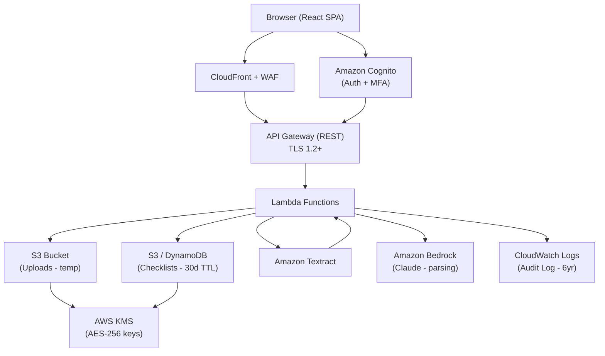

# Design Document: Discharge Checklist

## Overview

A HIPAA-compliant web application that allows patients and caregivers to upload photos or PDFs of hospital discharge papers. AWS AI services (Amazon Textract) extract the text, which is then parsed into a structured, editable checklist organized into five clinical categories. Users authenticate via Amazon Cognito, and all PHI is encrypted, audit-logged, and retained per HIPAA requirements.

The system is built as a serverless, cloud-native application on AWS to minimize operational overhead while meeting strict compliance requirements.

## Architecture



### Key Architectural Decisions

- **Serverless Lambda**: No persistent servers to patch; scales automatically; reduces attack surface.
- **S3 presigned URLs**: Images are uploaded directly from the browser to S3 (bypassing Lambda payload limits), then Lambda triggers processing. Temporary upload bucket has a 24-hour lifecycle rule.
- **Amazon Bedrock (Claude)**: Used for semantic parsing of Textract output into the five checklist categories. Textract handles OCR; Bedrock handles NLP categorization.
- **DynamoDB**: Stores checklists with a TTL attribute set to 30 days from creation. Per-user partition key enforces minimum necessary access.
- **CloudWatch Logs with log group retention**: Audit log entries are written as structured JSON to a dedicated CloudWatch log group with a 6-year retention policy. Log data is exported to S3 Glacier for long-term storage.
- **KMS**: All S3 buckets and DynamoDB tables use KMS-managed keys (SSE-KMS) for AES-256 encryption at rest.

## Components and Interfaces

### Frontend (React SPA)

Hosted on S3 + CloudFront. Communicates with the backend exclusively over HTTPS via API Gateway.

Key UI components:
- `AuthGuard` — wraps all routes, redirects unauthenticated users to login
- `Uploader` — drag-and-drop file picker; validates format (JPEG/PNG/PDF) and size (≤10 MB) client-side before requesting a presigned URL
- `ProcessingStatus` — polls job status endpoint, shows loading indicator
- `ChecklistView` — renders categories and items; supports add/edit/delete/check-off
- `ExportPanel` — triggers PDF generation and shareable URL creation

### Backend Lambda Functions

| Function | Trigger | Responsibility |
|---|---|---|
| `getUploadUrl` | API GW POST /upload-url | Validates auth, generates S3 presigned PUT URL, writes audit log |
| `processDocument` | S3 ObjectCreated event | Calls Textract, passes result to Bedrock, stores checklist in DynamoDB, writes audit log |
| `getChecklist` | API GW GET /checklist/{id} | Fetches checklist from DynamoDB (ownership check), writes audit log |
| `updateChecklist` | API GW PATCH /checklist/{id} | Applies item add/edit/delete mutations, writes audit log |
| `deleteChecklist` | API GW DELETE /checklist/{id} | Deletes checklist record, writes audit log |
| `exportPdf` | API GW POST /checklist/{id}/export | Generates PDF via `pdfkit`, returns presigned download URL |
| `shareChecklist` | API GW POST /checklist/{id}/share | Creates a signed read-only token, stores share record |
| `getSharedChecklist` | API GW GET /shared/{token} | Validates share token, returns read-only checklist |
| `exportAuditLog` | API GW GET /admin/audit | Admin-only; streams CloudWatch log export |

### Auth Service (Amazon Cognito)

- User Pool with password policy: min 12 chars, upper + lower + digit + special required
- MFA enforced via TOTP (software token)
- Account lockout: 5 failed attempts within 15 minutes triggers account lock + email notification via Cognito Lambda trigger
- Session tokens (JWT): 8-hour access token expiry
- Logout calls Cognito `globalSignOut` to invalidate all tokens

### Uploader Component Interface

```typescript
interface UploadRequest {
  fileName: string;       // original filename
  contentType: 'image/jpeg' | 'image/png' | 'application/pdf';
  fileSizeBytes: number;  // must be <= 10_485_760 (10 MB)
}

interface UploadUrlResponse {
  uploadId: string;       // UUID, becomes the S3 object key prefix
  presignedUrl: string;   // PUT URL, expires in 5 minutes
}
```

### Extractor / Parser Interface (internal Lambda)

```typescript
interface ExtractionResult {
  uploadId: string;
  rawText: string;        // concatenated Textract blocks
  confidence: number;     // average Textract confidence score
}

interface ParsedChecklist {
  checklistId: string;
  userId: string;
  createdAt: string;      // ISO 8601
  expiresAt: string;      // ISO 8601, createdAt + 30 days
  categories: ChecklistCategory[];
}

interface ChecklistCategory {
  name: 'Medications' | 'Daily Activities' | 'Follow-up Appointments' | 'Dietary Restrictions' | 'Warning Signs';
  items: ChecklistItem[];
}

interface ChecklistItem {
  itemId: string;         // UUID
  text: string;
  completed: boolean;
  dateTime?: string;      // ISO 8601, if a date/time was identified
  source: 'extracted' | 'user-added';
}
```

### Audit Log Entry Interface

```typescript
interface AuditLogEntry {
  eventId: string;        // UUID
  userId: string;
  eventType: 'LOGIN' | 'LOGOUT' | 'IMAGE_UPLOAD' | 'CHECKLIST_GENERATED' |
             'CHECKLIST_VIEWED' | 'CHECKLIST_EDITED' | 'CHECKLIST_DELETED' |
             'CHECKLIST_EXPORTED' | 'UNAUTHORIZED_ACCESS_ATTEMPT';
  timestamp: string;      // ISO 8601
  sourceIp: string;
  resourceId?: string;    // checklistId or uploadId if applicable
  details?: string;       // additional context
}
```

## Data Models

### DynamoDB: `discharge-checklists` Table

| Attribute | Type | Notes |
|---|---|---|
| `PK` | String | `USER#{userId}` |
| `SK` | String | `CHECKLIST#{checklistId}` |
| `checklistId` | String | UUID |
| `userId` | String | Cognito sub |
| `createdAt` | String | ISO 8601 |
| `ttl` | Number | Unix epoch; createdAt + 30 days |
| `categories` | Map | Serialized `ChecklistCategory[]` |
| `shareToken` | String | (optional) UUID for shared URL |
| `shareTokenExpiry` | String | (optional) ISO 8601 |

Access patterns:
- Get all checklists for a user: `PK = USER#{userId}`
- Get specific checklist: `PK = USER#{userId}`, `SK = CHECKLIST#{checklistId}`
- Get by share token: GSI on `shareToken`

Encryption: DynamoDB table uses SSE-KMS with a customer-managed KMS key.

### S3 Buckets

**`discharge-uploads-{accountId}`** (temporary)
- SSE-KMS encryption
- Lifecycle rule: delete objects after 24 hours
- Bucket policy: deny non-HTTPS access
- Objects keyed as `{userId}/{uploadId}/{filename}`

**`discharge-checklists-export-{accountId}`** (PDF exports)
- SSE-KMS encryption
- Lifecycle rule: delete objects after 7 days
- Presigned GET URLs issued with 1-hour expiry

### CloudWatch Log Group: `/discharge-checklist/audit`

- Retention: 2192 days (6 years)
- Log stream per Lambda invocation
- Structured JSON entries matching `AuditLogEntry` interface
- Subscription filter exports to S3 Glacier for long-term archival

### Cognito User Pool Attributes

| Attribute | Notes |
|---|---|
| `sub` | Immutable user identifier (used as `userId` throughout) |
| `email` | Required, verified |
| `email_verified` | Boolean |
| `custom:mfa_enabled` | Boolean, enforced at pool level |

