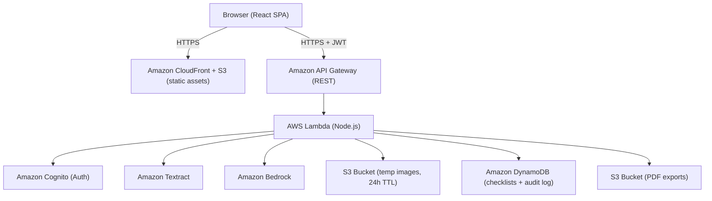

# Design Document: Discharge Checklist

## Overview

The Discharge Checklist application is a HIPAA-compliant web application that helps patients and caregivers convert hospital discharge papers into structured, actionable checklists. Users upload photos or PDFs of their discharge documents; the system extracts text via Amazon Textract, parses it into categorized checklist items with priority levels, and presents the result in an interactive UI. An AI assistant powered by Amazon Bedrock answers plain-language questions about the checklist.

### Key Design Goals

- HIPAA compliance: all PHI encrypted at rest (AES-256) and in transit (TLS 1.2+), with a full audit log
- Minimal PHI surface area: raw images and extracted text are ephemeral; only the structured checklist is persisted
- Separation of concerns: Uploader, Extractor, Parser, Pretty_Printer, Auth_Service, and AI_Assistant are distinct components with well-defined interfaces
- Round-trip fidelity: parsing → formatting → parsing produces an equivalent checklist (Requirement 3.5)

---

## Architecture

The system follows a serverless, event-driven architecture on AWS.



### Request Flow

1. User authenticates via Cognito; receives a JWT (max 8h expiry).
2. User uploads image(s) → API Gateway → Lambda → S3 (temp bucket, server-side AES-256 encryption, 24h lifecycle rule).
3. Lambda calls Textract; on success, passes raw text to the Parser Lambda.
4. Parser produces a structured `Checklist` object, which is saved to DynamoDB (encrypted at rest).
5. Raw extracted text is discarded after parsing (never persisted).
6. The React SPA fetches the checklist and renders it via the Pretty_Printer component.
7. AI_Assistant queries are sent to Bedrock with the checklist content as context; responses are streamed back.

---

## Components and Interfaces

### Uploader

Responsible for client-side validation and upload orchestration.

```typescript
interface UploadRequest {
  file: File;           // JPEG | PNG | PDF, max 10 MB
  sessionId: string;
}

interface UploadResponse {
  uploadId: string;     // S3 object key
  previewUrl: string;   // pre-signed URL for image preview
}

// Validates format and size before upload; throws UploadValidationError on failure
function validateFile(file: File): void;

// Returns a pre-signed S3 PUT URL; Lambda generates it
async function getUploadUrl(req: UploadRequest): Promise<UploadResponse>;
```

Constraints:
- Accepted MIME types: `image/jpeg`, `image/png`, `application/pdf`
- Max file size: 10 MB
- Max files per session: 10

### Extractor

Server-side Lambda that calls Textract.

```typescript
interface ExtractionRequest {
  uploadId: string;   // S3 object key
  userId: string;
}

interface ExtractionResult {
  rawText: string;    // concatenated text blocks from Textract
  uploadId: string;
}

// Calls Textract DetectDocumentText (images) or AnalyzeDocument (PDFs)
// Throws ExtractionError if Textract returns an error
async function extractText(req: ExtractionRequest): Promise<ExtractionResult>;
```

Timeout: 30 seconds per image (Requirement 2.5).

### Parser

Server-side Lambda that converts raw text into a structured checklist.

```typescript
type Category =
  | "Medications"
  | "DailyActivities"
  | "FollowUpAppointments"
  | "DietaryRestrictions"
  | "WarningSigns";

type PriorityLevel = "High" | "Routine";

interface ChecklistItem {
  id: string;           // UUID
  text: string;
  category: Category;
  priority: PriorityLevel;
  dateTime?: string;    // ISO 8601 if present
  completed: boolean;
}

interface Checklist {
  id: string;           // UUID
  userId: string;
  createdAt: string;    // ISO 8601
  updatedAt: string;
  items: ChecklistItem[];
}

// Parses raw text into a Checklist; throws ParseError if no items found
function parseText(rawText: string, userId: string): Checklist;

// Serializes a Checklist to a canonical JSON string
function formatChecklist(checklist: Checklist): string;

// Deserializes a canonical JSON string back to a Checklist
function parseChecklist(json: string): Checklist;
```

Categorization uses keyword/pattern matching (e.g., drug names → Medications, temperature thresholds → WarningSigns). Priority is set to `High` for items matching risk patterns (fever, chest pain, difficulty breathing, uncontrolled bleeding).

### Pretty_Printer

React component that renders a `Checklist`.

```typescript
interface PrettyPrinterProps {
  checklist: Checklist;
  readOnly?: boolean;
  onItemToggle: (itemId: string) => void;
  onItemAdd: (category: Category, text: string, priority: PriorityLevel) => void;
  onItemEdit: (itemId: string, text: string) => void;
  onItemDelete: (itemId: string) => void;
  onPriorityChange: (itemId: string, priority: PriorityLevel) => void;
}
```

Rendering rules:
- Categories rendered as sections with heading + `Category_Icon` (≥24×24 px, unique color per category).
- Within each section: `High` priority items first, then `Routine`.
- `High` items styled with red/amber indicator and "High Priority" label.
- Completed items visually distinguished (strikethrough + muted color).
- Date/time displayed inline when present.

### Auth_Service

Backed by Amazon Cognito User Pools.

```typescript
interface AuthTokens {
  accessToken: string;   // JWT, max 8h expiry
  refreshToken: string;
  idToken: string;
}

interface LoginRequest {
  username: string;
  password: string;
  totpCode?: string;
}

async function login(req: LoginRequest): Promise<AuthTokens>;
async function logout(accessToken: string): Promise<void>;
async function refreshSession(refreshToken: string): Promise<AuthTokens>;
```

Policy:
- Password: min 12 chars, upper + lower + digit + special character.
- Account lockout: 5 failed attempts within 15 minutes → lock + email notification.
- MFA: TOTP required (Cognito MFA enforcement).
- Session expiry: 8 hours; expired tokens redirect to login.

### AI_Assistant

React chat component + Lambda backend.

```typescript
interface AssistantRequest {
  sessionId: string;
  question: string;
  checklistContext: Checklist;   // current user checklist only
  conversationHistory: Message[];
}

interface AssistantResponse {
  answer: string;
  disclaimer: string;  // always appended
}

interface Message {
  role: "user" | "assistant";
  content: string;
}

async function askAssistant(req: AssistantRequest): Promise<AssistantResponse>;
```

Constraints:
- Only the user's own checklist is sent to Bedrock (no raw PHI beyond checklist content).
- Response within 10 seconds under normal conditions.
- Conversation context maintained for the active session.
- Audit log entry on every invocation (no question/response content logged).
- Unavailable when user is unauthenticated.

### Audit_Log

DynamoDB table with append-only writes (no update/delete permissions for application role).

```typescript
interface AuditLogEntry {
  entryId: string;       // UUID
  userId: string;
  eventType: AuditEventType;
  timestamp: string;     // ISO 8601
  sourceIp: string;
}

type AuditEventType =
  | "LOGIN" | "LOGOUT"
  | "IMAGE_UPLOAD" | "CHECKLIST_GENERATED"
  | "CHECKLIST_VIEW" | "CHECKLIST_EDIT"
  | "CHECKLIST_DELETED" | "CHECKLIST_EXPORT"
  | "AI_ASSISTANT_INVOKED"
  | "UNAUTHORIZED_ACCESS_ATTEMPT";
```

Retention: DynamoDB TTL disabled for audit entries; entries retained ≥6 years (Requirement 8.5). An admin export Lambda reads the table and streams entries to S3.

---

## Data Models

### DynamoDB Table: `checklists`

| Attribute    | Type   | Notes                          |
|--------------|--------|--------------------------------|
| `pk`         | String | `USER#{userId}`                |
| `sk`         | String | `CHECKLIST#{checklistId}`      |
| `checklist`  | Map    | Serialized `Checklist` object  |
| `createdAt`  | String | ISO 8601                       |
| `updatedAt`  | String | ISO 8601                       |
| `ttl`        | Number | Unix epoch + 30 days           |

Encryption: DynamoDB encryption at rest with AWS-managed KMS key (AES-256).

### DynamoDB Table: `audit_log`

| Attribute   | Type   | Notes                    |
|-------------|--------|--------------------------|
| `pk`        | String | `AUDIT#{userId}`         |
| `sk`        | String | `TS#{timestamp}#{uuid}`  |
| `eventType` | String | `AuditEventType`         |
| `sourceIp`  | String |                          |

No TTL; IAM policy denies `DeleteItem` and `UpdateItem` for the application role.

### S3 Buckets

- `discharge-images-temp`: uploaded images, SSE-S3 (AES-256), lifecycle rule deletes objects after 24 hours.
- `discharge-exports`: generated PDF exports, SSE-S3, per-user prefix for access control.

### Shared URL Model

Shared checklists are stored as a separate DynamoDB item:

| Attribute     | Type   | Notes                        |
|---------------|--------|------------------------------|
| `pk`          | String | `SHARE#{shareToken}`         |
| `sk`          | String | `CHECKLIST`                  |
| `checklistId` | String | Reference to source checklist|
| `readOnly`    | Bool   | Always `true`                |
| `ttl`         | Number | Optional expiry              |

---

## Correctness Properties

*A property is a characteristic or behavior that should hold true across all valid executions of a system — essentially, a formal statement about what the system should do. Properties serve as the bridge between human-readable specifications and machine-verifiable correctness guarantees.*

